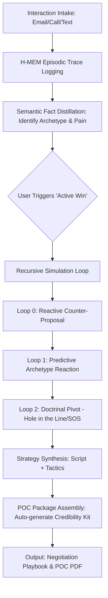

# PartnerOS v5.0 Pillar 2: 'Active Winning' Strategy PRD

**Date:** 2026-03-25  
**Status:** Draft  
**Pillar:** 2 (Active Winning)  
**Author:** Gemini CLI (Autonomous Agent)

## 1. Executive Summary
The 'Active Winning' Strategy (Pillar 2) transforms PartnerOS from a passive analysis tool into a proactive negotiation powerhouse. By leveraging **Recursive Agentic Negotiation Loops**, **Psychological Archetype Modeling**, and **Automated Proof of Credibility**, the system empowers users to win complex commercial real estate (CRE) deals through the strategic application of Greg Pinneo's doctrines ("Hole in the Line" and "Substitution of Security").

---

## 2. Core Concepts & Research

### 2.1 Recursive Agentic Negotiation Loops (K-Level Reasoning)
The system employs multi-level reasoning to anticipate and influence counterparty behavior:
- **Level 0 (Direct):** Basic proposal based on market data and target returns.
- **Level 1 (Predictive):** Simulation of counterparty's likely rejection or counter-offer based on their identified archetype.
- **Level 2 (Meta-Strategic):** "I think that you think that I think..." — The agent adjusts its strategy to counter the counterparty's expected resistance, often by pivoting to a "Hole in the Line" solution.

### 2.2 Psychological Archetype Modeling (CRE Specific)
Counterparties are mapped to one of four primary CRE archetypes via semantic fact distillation:
1.  **The Institutionalist:** Driven by process, LTVs, and committee approvals. Requires data-heavy credibility.
2.  **The Legacy Owner:** Driven by emotional attachment and tax implications. Requires "Substitution of Security" or "Deferred Interest" solutions.
3.  **The Distressed Desperado:** Driven by speed and relief. Requires immediate "Hole in the Line" identification (e.g., solving an underlying debt issue).
4.  **The Sophisticated Hunter:** Driven by ROE and arbitrage. Requires "Substitution of Collateral" or "Note Splitting" discussions.

### 2.3 Automated 'Proof of Credibility' (POC)
The POC engine assembles a dynamic "Credibility Kit" (Pinneo Doctrine) tailored to the seller's archetype:
- **Components:** Executive Summary, Professional Team (CPA, Attorney), Portfolio Performance, and "The Three Pillars" Analysis.
- **Delivery:** Auto-generated PDF/Web-portal for the seller/lender.

---

## 3. Recursive Negotiation Simulator Design

### 3.1 Logic Flowchart (Text-Based)



### 3.2 Pinneo Doctrine Integration
- **Hole in the Line:** The simulator scans episodic traces for "unmet needs" (e.g., a seller wanting to retire but fearing capital gains). It proposes a lateral move (Seller Financing + SOS) instead of a head-on price battle.
- **Substitution of Security (SOS):** When a seller demands cash for a specific goal (e.g., buying a boat), the system identifies the "why" and proposes a collateral swap or direct asset provision to preserve favorable debt terms on the subject property.

---

## 4. H-MEM Schema Updates

To support Pillar 2, the Hierarchical Cognitive Memory (H-MEM) requires the following additions:

### 4.1 New Database Tables

```sql
-- Migration 005: Active Winning Strategy (Pillar 2)

-- 1. Negotiation Simulations: Stores K-level traces
CREATE TABLE IF NOT EXISTS negotiation_simulations (
    id                INTEGER PRIMARY KEY AUTOINCREMENT,
    deal_id           TEXT NOT NULL REFERENCES deals(deal_id),
    simulation_date   TEXT NOT NULL,
    k_level           INTEGER NOT NULL, -- 0, 1, or 2
    archetype_used    TEXT NOT NULL,
    input_state       TEXT NOT NULL, -- JSON snapshot of context
    simulated_output  TEXT NOT NULL, -- The 'thought' of the agent
    tactic_proposed   TEXT NOT NULL,
    created_at        TEXT DEFAULT CURRENT_TIMESTAMP
);

-- 2. Credibility Packages: Tracks generated kits
CREATE TABLE IF NOT EXISTS credibility_packages (
    id                INTEGER PRIMARY KEY AUTOINCREMENT,
    seller_id         TEXT NOT NULL,
    package_type      TEXT CHECK(package_type IN ('INSTITUTIONAL','LEGACY','DISTRESSED','GENERAL')),
    pdf_path          TEXT,
    content_summary   TEXT, -- JSON of components included
    generated_at      TEXT DEFAULT CURRENT_TIMESTAMP
);

-- 3. Extend Semantic Facts with Archetype keys (Conceptual)
-- trait_key: 'psych_archetype', 'primary_pain_column', 'sos_receptivity'
```

---

## 5. Implementation Strategy

### 5.1 Step 1: Archetype Tagger
Develop an NLP-based tagger that processes `episodic_traces` to update `semantic_facts` with psychological markers.

### 5.2 Step 2: Recursive Simulation Engine
Implement a LangGraph-based recursive loop where a "Mock Seller" agent (parameterized by archetype) critiques the "Buyer" agent's offers until a "Hole in the Line" is found.

### 5.3 Step 3: POC Assembly
Create a template-based PDF generator that pulls data from `user_profile`, `portfolio`, and `deal_analysis` to build the Credibility Kit.

---

## 6. Success Metrics

| Metric | Target |
| :--- | :--- |
| **LOI Acceptance Rate** | > 25% increase vs. v4.0 baseline |
| **Negotiation Cycle Time** | 30% reduction (fewer rounds of "blind" haggling) |
| **Doctrinal Usage** | > 40% of deals closed using SOS or Hole in the Line |
| **User Confidence Score** | Avg 4.5/5.0 in post-simulation surveys |

---

## 7. Future Considerations
- **Live Mirroring:** Real-time archetype suggestions during live calls via voice-to-text integration.
- **Multi-Party Simulation:** Modeling the interaction between Seller, Broker, and Lender simultaneously.
